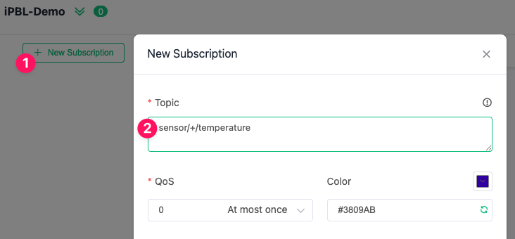
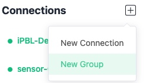
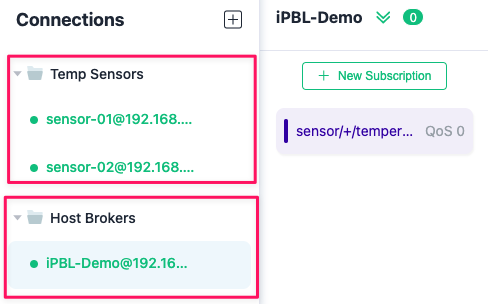

# クイックチュートリアル

# MQTT 入門

MQTT の使い方について簡単なデモを始めます。しかし始める前に、MQTT ブローカーと MQTT クライアントを準備する必要があります。

# MQTT ブローカーを準備してください。

このトレーニングのために、テスト用にプライベートデプロイメントで MQTT ブローカーを作成するか、無料のパブリックブローカーを選択することができます。

- ## プライベート展開

  このデモでは、ローカルマシンで展開するための IOT、IIOT、および接続された車両のためのオープンソースの MQTT ブローカーである[EMQX](https://www.emqx.io/)を使用します。

  もし Docker がインストールされている場合、次のコマンドを実行して EMQX をインストールすることができます：

  `docker run -d --name emqx -p 1883:1883 -p 8083:8083 -p 8084:8084 -p 8883:8883 -p 18083:18083 emqx/emqx`

- ## 無料の公開ブローカー

  以下のサーバー情報を設定することができます。無料のパブリックブローカーを使用する場合。

  | **Name**      | **Broker Address**        | **TCP Port** | **TLS Port** | **WebSocket Port(s)** |
  | ------------- | ------------------------- | ------------ | ------------ | --------------------- |
  | EMQX (Global) | `broker.emqx.io`          | 1883         | 8883         | 8083, 8084            |
  | EMQX (CN)     | `broker-cn.emqx.io`       | 1883         | 8883         | 8083, 8084            |
  | Eclipse       | `mqtt.eclipseprojects.io` | 1883         | 8883         | 80, 443               |
  | Mosquitto     | `test.mosquitto.org`      | 1883         | 8883, 8884   | 80, 443               |
  | HiveMQ        | `broker.hivemq.com`       | 1883         | N/A          | 8000                  |

# MQTT クライアントを準備してください。

私たちは、MQTTX が提供する MQTT クライアントツールを使用します。このツールは、以下の機能をサポートしています。

- ブラウザでアクセスする - [http://www.emqx.io/online-mqtt-client](http://www.emqx.io/online-mqtt-client)
- デスクトップクライアント - https：[//mqttx.app](//mqttx.app)
- コマンドラインツール - [https://mqttx.app/cli](https://mqttx.app/cli)

デモでは、デスクトップクライアントを使用しますが、ブラウザや CLI でも問題ありません。

[MQTTX](https://mqttx.app/)は、macOS、Linux、Windows で動作するエレガントなクロスプラットフォーム MQTT 5.0 デスクトップクライアントです。ユーザーフレンドリーなチャットスタイルのインターフェースにより、複数の MQTT/MQTTS 接続を簡単に作成し、MQTT メッセージをパブリッシュ/サブスクライブすることができます。

[異なるプログラミング言語用のオープンソースの MQTT クライアントライブラリもあります](https://www.emqx.com/en/mqtt-client-sdk)。後で ESP8266 NodeMCU と通信するために、私たちは Flutter でモバイルアプリケーションを作成する際に、それらのうち 2 つを使用します。

# MQTT 接続を作成する

通信には MQTT を使用するため、クライアントはブローカーとの MQTT 接続を確立する必要があります。

1. 正常に動作しているかどうかブローカーを確認してください。 [http://localhost:18083](http://localhost:18083) でダッシュボードを開き、デフォルトの資格情報で`admin:public` でログインしてください。クラスタにアクセスでき、生きていて健全であることを確認してください。

   

1. 次に、MQTT クライアントを開き、「`新しい接続`」ボタンをクリックしてください。
1. 名前のフィールドには「`iPBL-Demo`」と入力し、ホストのフィールドには IP アドレス（またはパブリックブローカーアドレス）を入力してください。
1. 右上隅にある「`接続`」ボタンをクリックし、接続が正常に確立されたことを示す「`接続完了`」のポップアップが表示されることを確認してください。

   

   

# トピックに登録する

このデモでは、以前に作成した`iPBL-Demo`接続で、ワイルドカードトピック`sensor/+/temperature`にサブスクライブします。これにより、他のセンサークライアントが報告する温度データを受信します。

1. 新しい購読ボタンをクリックし、ポップアップボックスのトピックフィールドに`sensor/+/temperature`と入力してください。
2. デフォルトの QoS を 0 に保ち、確認をクリックしてください。

   

3. 購読が成功すると、購読リストに追加のレコードが表示されます。

   

# MQTT メッセージを公開する

1. 「`sensor-01`」と「`sensor-02`」という名前で、2 つの温度センサーをシミュレートするために、さらに 2 つの接続を作成してください。

   

1. 接続が作成されると、3 つの接続が表示され、接続名の左側にオンラインステータスのドットが緑で表示されます。

   

1. 関連するコネクションをまとめるために、新しいグループを作成し、まとめたいコネクションを選択して新しいグループにドラッグすることもできます。

   

   

1. メッセージを送信するには、ページの左下部にある`sensor-01`の接続を選択し、トピックとして`sensor/01/temperature`を入力します。ペイロードのタイプを選択し、メッセージボックスに入力して、右下の公開ボタンをクリックしてください。

   

1. 同じ手順を使用して、`sensor-02`の接続において、`sensor/02/temperature`トピックに新しいペイロードメッセージを公開します。
1. `iPBL-Demo` 接続では、2 つのセンサーから送信された 2 つの新しいメッセージが表示されます。

   

これで、MQTT におけるパブリッシュ-サブスクライブパターンの簡単なデモンストレーションを終了します。MQTTX クライアントツールは、パブサブパターンを超えてさらに探求するための追加機能をサポートしています。

次のセクションでは、これらのアイデアを詳しく説明し、ESP8266 NodeMCU の内蔵 LED ライトを制御するためのモバイルアプリを開発します。
