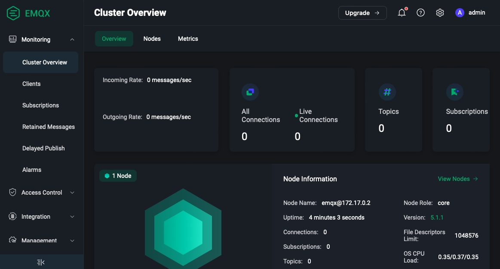

# 快速教程

# 開始使用 MQTT

我們現在將開始展示如何使用 MQTT 的簡單示範。但在我們開始之前，您需要準備一個 MQTT 代理和一個 MQTT 客戶端。

# 準備一個 MQTT Broker

為了這個訓練，您可以選擇通過私有部署創建 MQTT Broker，或者使用免費的公共 Broker 進行測試。

- ## 私人部署

  在這個示範中，我將使用[EMQX](https://www.emqx.io/)，一個開源的 MQTT 代理程式，用於在本地機器上部署於物聯網、工業物聯網和連接車輛等領域。

  如果您已經安裝了 Docker，您可以運行以下命令來安裝 EMQX：

  `docker run -d --name emqx -p 1883:1883 -p 8083:8083 -p 8084:8084 -p 8883:8883 -p 18083:18083 emqx/emqx`

- ## 免费公共经纪人

  如選擇使用免費公共代理（broker），您可以設定以下伺服器資訊。

  | **Name**      | **Broker Address**        | **TCP Port** | **TLS Port** | **WebSocket Port(s)** |
  | ------------- | ------------------------- | ------------ | ------------ | --------------------- |
  | EMQX (Global) | `broker.emqx.io`          | 1883         | 8883         | 8083, 8084            |
  | EMQX (CN)     | `broker-cn.emqx.io`       | 1883         | 8883         | 8083, 8084            |
  | Eclipse       | `mqtt.eclipseprojects.io` | 1883         | 8883         | 80, 443               |
  | Mosquitto     | `test.mosquitto.org`      | 1883         | 8883, 8884   | 80, 443               |
  | HiveMQ        | `broker.hivemq.com`       | 1883         | N/A          | 8000                  |

# 準備一個 MQTT 客戶端

我們將使用 MQTTX 提供的 MQTT 客戶端工具，該工具支援以下功能：

- 瀏覽器訪問- [http://www.emqx.io/online-mqtt-client](http://www.emqx.io/online-mqtt-client)
- 桌面客戶端-[https://mqttx.app](https://mqttx.app)
- 指令列工具 - [https://mqttx.app/cli](https://mqttx.app/cli)

在示範中，我將使用桌面客戶端，但使用瀏覽器或命令行界面也可以。

[MQTTX](https://mqttx.app)是一個優雅的跨平台 MQTT 5.0 桌面客戶端，適用於 macOS、Linux 和 Windows。用戶友好的聊天式界面使用戶可以輕鬆創建多個 MQTT/MQTTS 連接並發布/訂閱 MQTT 消息。

[也有開源 MQTT 客戶端庫可供不同的編程語言使用](https://www.emqx.com/en/mqtt-client-sdk)。我們將使用其中兩個，因為我們稍後要用 Flutter 創建一個移動應用程序來與我們的 ESP8266 NodeMCU 通信。

# 建立一個 MQTT 連接

使用 MQTT 進行通訊，客戶端必須與代理建立 MQTT 連接。

1. 檢查您的經紀人是否正常運作。在 [http://localhost:18083](http://localhost:18083) 上打開儀表板，使用預設的憑證 `admin:public` 登入。確保您可以訪問您的集群並且它運作正常且健康。

   

1. 接下來，打開你的 MQTT 客戶端，並點擊「`新連接`」按鈕。
1. 填入「`iPBL-Demo`」作為名稱欄位，並填入您的 IP 位址（或公共經紀人位址）在主機欄位中。
1. 點擊右上角的連接按鈕，並確認出現一個「`已連接`」的彈出視窗，表示連接成功。

   

   

# 訂閱一個主題

在這個演示中，我們將訂閱之前建立的`iPBL-Demo`連接中的通配符主題`sensor/+/temperature`。這將聽取所有其他感測器客戶端報告的溫度數據。

1. 點擊「`新訂閱`」按鈕，在彈出框的主題欄位中輸入 `sensor/+/temperature`。
2. 保持預設的 QoS 為 0，然後點擊確認。

   

3. 當訂閱成功時，訂閱清單中會顯示額外的一筆記錄。

   

# 發佈 MQTT 訊息

1. 建立其他兩個連接並分別命名為`sensor-01`和`sensor-02`，模擬兩個溫度感測器。

   

1. 一旦連接建立，您將看到三個連接，並且在連接名稱左邊顯示綠色的在線狀態點。

   

1. 你也可以通過創建新組將相關聯的連接聚集在一起，選擇你想要聚集的連接並將它們拖到新創建的組中。

   

   

1. 要发送消息，请选择`sensor-01`连接，并在页面左下角输入主题为`sensor/01/temperature`。选择有效载荷类型，填写消息框，然后点击页面右下角的发布按钮。

   

1. 使用相同的步驟，將新的有效載荷訊息發佈到`sensor-02`連接中的`sensor/02/temperature`主題。
1. 你將會在`iPBL-Demo`連線下看到兩個新訊息，因為它們是由兩個感應器發送的。

   

這樣我們就結束了對 MQTT 中發布-訂閱模式的簡要演示。MQTTX 客戶端工具支援更多功能，讓您可以探索超越發布-訂閱模式的領域。

喺下一節，我哋會進一步詳細講解呢啲意念同埋開發一個手機應用程序嚟控制 ESP8266 NodeMCU 嘅內置 LED 燈。
